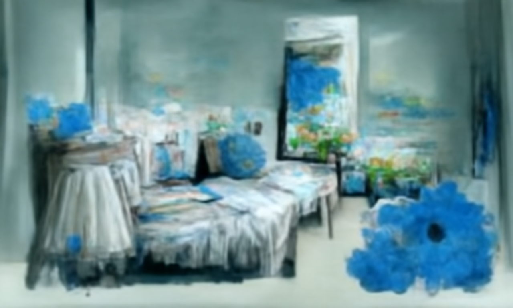
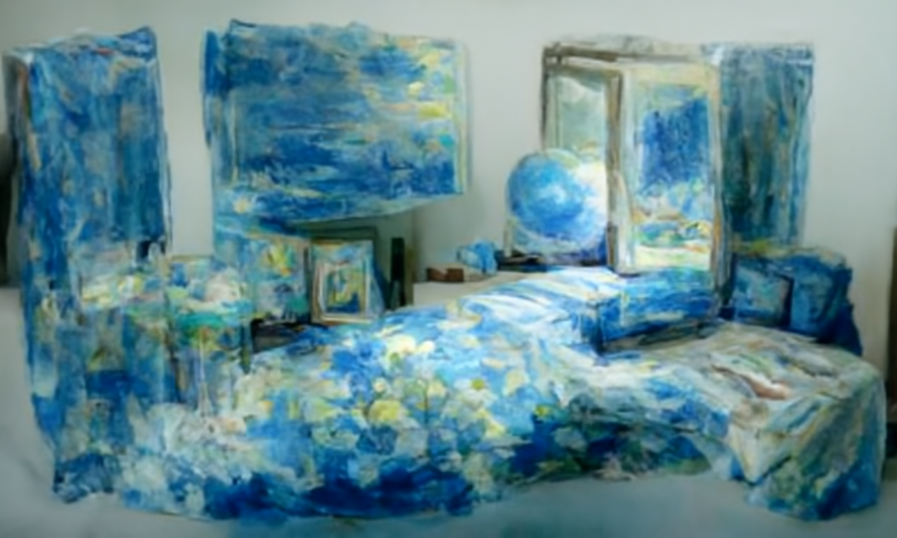

# openddimg
**Images generated by disco diffusion**

[**Disco Diffusion](https://github.com/alembics/disco-diffusion)

**2022.4.29 Update**

All default settings with 1/3 and 2/3 batch generating. 

**Text:** ["room is gradually like a universe without companion","impressionism style","light blue"]
