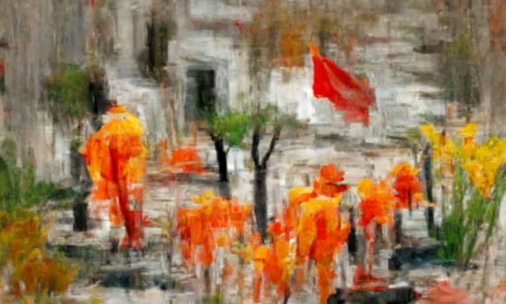
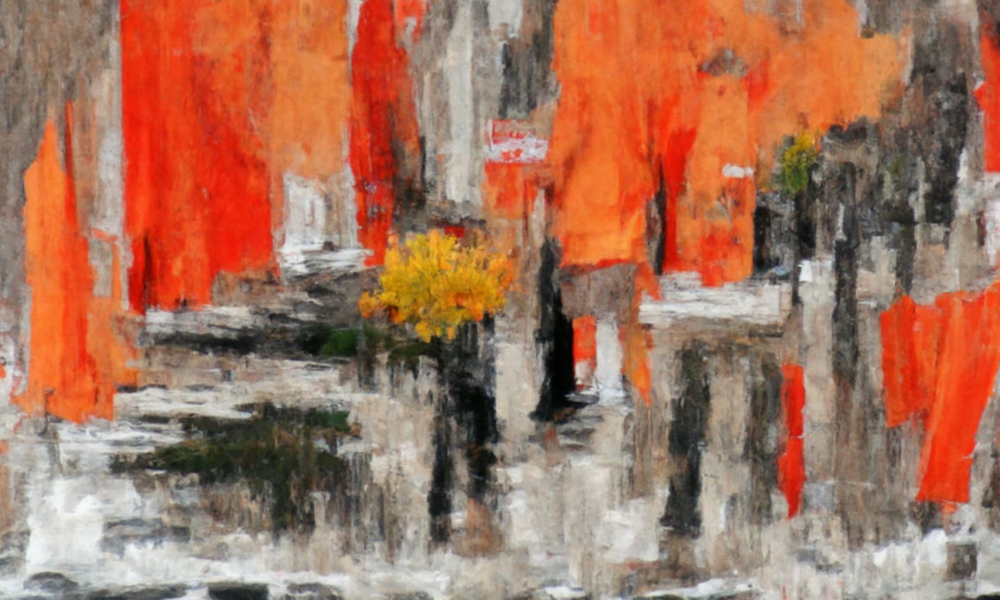
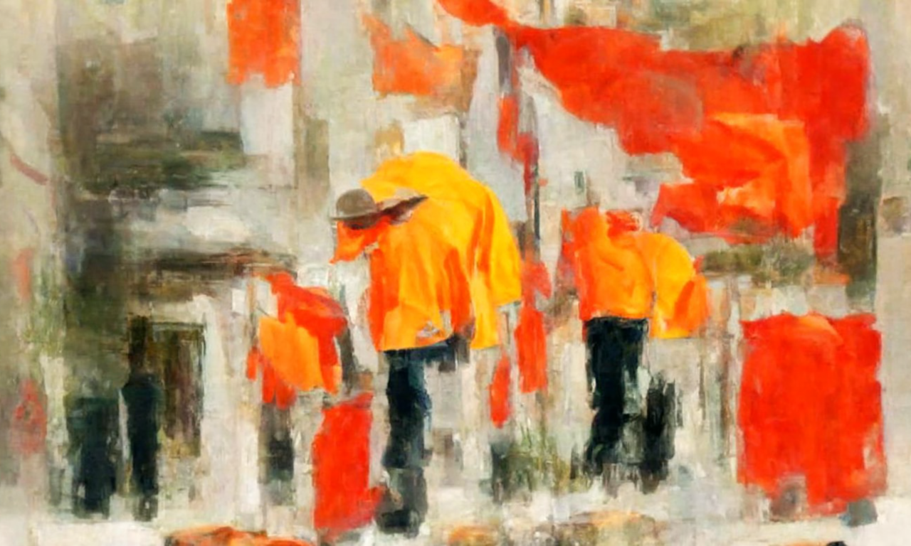
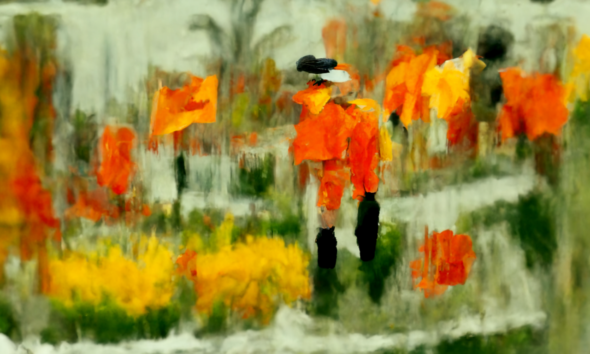
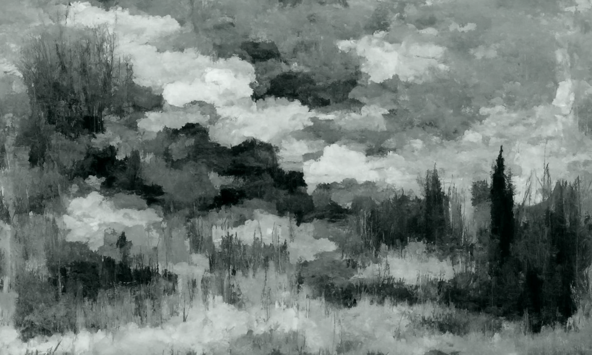
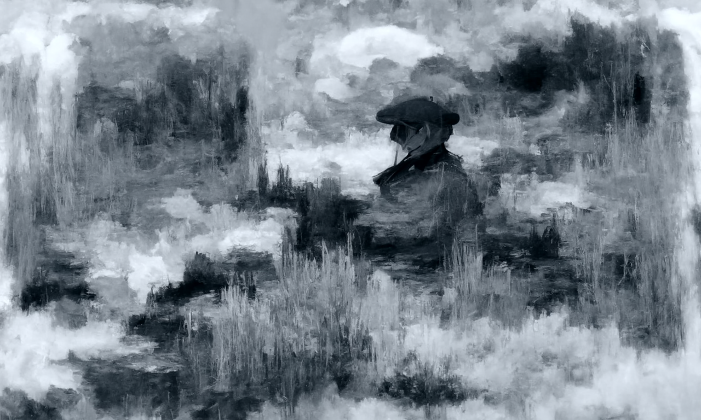
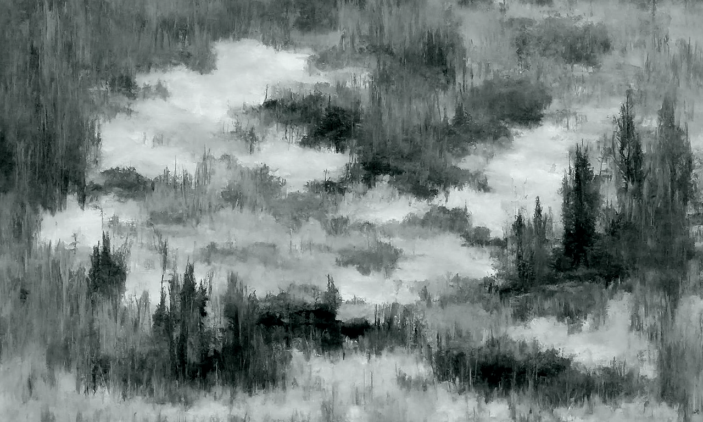
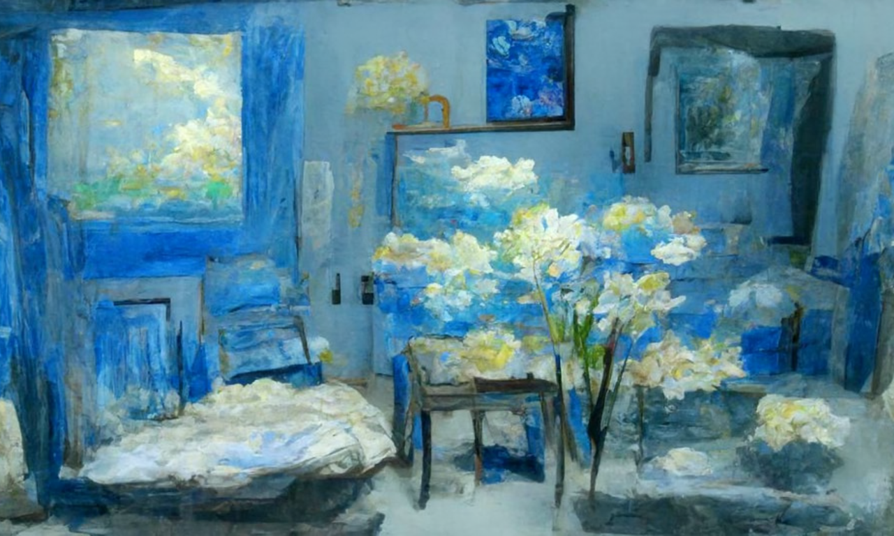
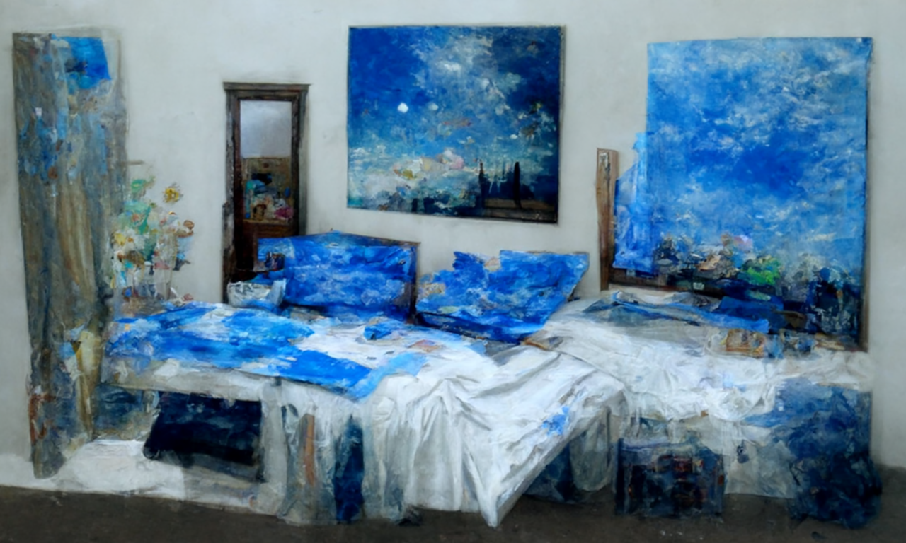

# Openddimg
**Images generated by** [**Disco Diffusion**](https://github.com/alembics/disco-diffusion)

**2022.5.1 Update**

**Text:** ["we exist and connot touch the country beneath our feet Ten steps away we cannot hear our language","impressionism style","orange scheme"]

**Text:** ["he calls scrape those fiddles more darkly then as smoke you'll rise in the air","impressionism style","grey scheme"]

**2022.4.30 Update**

**Text:** ["whoever is alone now will remain so for a long time","impressionism style","light yellow"]

**2022.4.29 Update**

**Text:** ["room is gradually like a universe without companion","impressionism style","light blue"]

